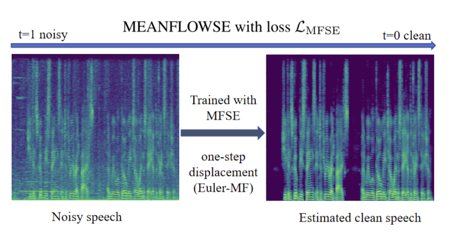

# MeanFlowSE — One-Step Generative Speech Enhancement

**MeanFlowSE** is a conditional generative approach for speech enhancement that learns **average velocities** over short time spans and enables **single-step (1-NFE)** inference with a simple displacement update. No teacher models or distillation are required. A few-step variant is also supported for extra quality.

* **MEANFLOWSE: ONE-STEP GENERATIVE SPEECH ENHANCEMENT VIA CONDITIONAL MEAN FLOW**
    

* 📝 **Paper**: *Under review.* **arXiv link coming soon.**
* 🎧 **Demo**: demo page coming soon.

---

## Table of Contents

* [Highlights](#highlights)
* [What’s inside](#whats-inside)
* [Quick start](#quick-start)

  * [Installation](#installation)
  * [Data preparation](#data-preparation)
  * [Training](#training)
  * [Inference](#inference)
* [Configuration](#configuration)
* [Repository structure](#repository-structure)
* [Built upon & related work](#built-upon--related-work)
* [Pretrained models](#pretrained-models)
* [Acknowledgments](#acknowledgments)
* [Citation](#citation)

---

## Highlights

* **1-step inference (Euler-MF):** replace multi-step ODE integration with one backward-in-time displacement.
* **Teacher-free training:** local objective using JVP; still consistent with conditional flow matching on the diagonal.
* **Few-step refinement:** optional multi-step mode (Euler-style) for higher quality at small extra cost.
* **Competitive & fast:** strong ESTOI / SI-SDR / DNSMOS with **very low RTF** on VoiceBank-DEMAND.

---

## What’s inside

* **Training** with Average field supervision (for the 1-step displacement sampler).
* **Inference** with  euler_mf — single-/few-step displacement along average field.
* **Audio front-end**: complex STFT pipeline; configurable transforms & normalization.
* **Metrics**: PESQ, ESTOI, SI-SDR; end-to-end **RTF** measurement (includes STFT/ISTFT).

---

## Quick start

### Installation

```bash
# Python 3.10 recommended

pip install -r requirements.txt
# Use a recent PyTorch + CUDA build for multi-GPU training
```

### Data preparation

Expected layout:

```
<BASE_DIR>/
  train/clean/*.wav   train/noisy/*.wav
  valid/clean/*.wav   valid/noisy/*.wav
  test/clean/*.wav    test/noisy/*.wav
```

Defaults assume 16 kHz audio, centered frames, Hann windows, and a complex STFT representation (see `SpecsDataModule` for knobs).

### Training

**Single machine, multi-GPU (DDP)**:

```bash
# Edit DATA_DIR and GPUs inside the script if needed
bash train_vbd.sh
```

Or run directly:

```bash
torchrun --standalone --nproc_per_node=4 train.py \
  --backbone ncsnpp \
  --ode flowmatching \
  --base_dir <BASE_DIR> \
  --batch_size 2 \
  --num_workers 8 \
  --max_epochs 150 \
  --precision 32 \
  --gradient_clip_val 1.0 \
  --t_eps 0.03 --T_rev 1.0 \
  --sigma_min 0.0 --sigma_max 0.487 \
  --use_mfse \
  --mf_weight_final 0.25 \
  --mf_warmup_frac 0.5 \
  --mf_delta_gamma_start 8.0 --mf_delta_gamma_end 1.0 \
  --mf_delta_warmup_frac 0.7 \
  --mf_r_equals_t_prob 0.1 \
  --mf_jvp_clip 5.0 --mf_jvp_eps 1e-3 \
  --mf_jvp_impl fd --mf_jvp_chunk 1 \
  --mf_skip_weight_thresh 0.05 \
  --val_metrics_every_n_epochs 1 \
  --default_root_dir lightning_logs
```

* **Logging & checkpoints** live under `lightning_logs/<exp_name>/version_x/`.
* Heavy validation (PESQ/ESTOI/SI-SDR) runs **every N epochs** on **rank-0**; placeholders are logged otherwise so checkpoint monitors remain valid.

### Inference

Use the helper script:

```bash
# MODE = multistep | multistep_mf | onestep
MODE=onestep STEPS=1 \
TEST_DATA_DIR=<BASE_DIR> \
CKPT_INPUT=path/to/best.ckpt \
bash run_inference.sh
```

Or call the evaluator:

```bash
python evaluate.py \
  --test_dir <BASE_DIR> \
  --folder_destination /path/to/output \
  --ckpt path/to/best.ckpt \
  --odesolver euler_mf \
  --reverse_starting_point 1.0 \
  --last_eval_point 0.0 \
  --one_step
```

> `evaluate.py` writes **enhanced WAVs**.
> If `--odesolver` is not given, it **auto-picks** (`euler_mf` when MF-SE was used; otherwise `euler`).

---

## Configuration

Common flags you may want to tweak:

* **Time & schedule**

  * `--T_rev` (reverse start, default 1.0), `--t_eps` (terminal time), `--sigma_min`, `--sigma_max`
* **MF-SE stability**

  * `--mf_jvp_impl {auto,fd,autograd}`, `--mf_jvp_chunk`, `--mf_jvp_clip`, `--mf_jvp_eps`
  * Curriculum: `--mf_weight_final`, `--mf_warmup_frac`, `--mf_delta_*`, `--mf_r_equals_t_prob`
* **Validation cost**

  * `--val_metrics_every_n_epochs`, `--num_eval_files`
* **Backbone & front-end**

  * Defined in `backbones/` and `SpecsDataModule` (STFT, transforms, normalization)

---

## Repository structure

```
MeanFlowSE/
├── train.py                 # Lightning entry
├── evaluate.py              # Enhancement script (WAV out)
├── run_inference.sh         # One-step / few-step convenience runner
├── flowmse/
│   ├── model.py             # Losses, JVP, curriculum, logging
│   ├── odes.py              # Path definition & registry
│   ├── sampling/
│   │   ├── __init__.py
│   │   └── odesolvers.py    # Euler (instantaneous) & Euler-MF (displacement)
│   ├── backbones/
│   │   ├── ncsnpp.py        # U-Net w/ time & delta embeddings
│   │   └── ...
│   ├── data_module.py       # STFT I/O pipeline
│   └── util/                # metrics, registry, tensors, inference helpers
├── requirements.txt
└── scripts/
    └── train_vbd.sh
```

## Built upon & related work

This repository builds upon previous great works:

* **SGMSE** — [https://github.com/sp-uhh/sgmse](https://github.com/sp-uhh/sgmse)
* **SGMSE-CRP** — [https://github.com/sp-uhh/sgmse\_crp](https://github.com/sp-uhh/sgmse_crp)
* **SGMSE-BBED** — [https://github.com/sp-uhh/sgmse-bbed](https://github.com/sp-uhh/sgmse-bbed)
* **FLOWMSE (FlowSE)** — [https://github.com/seongq/flowmse](https://github.com/seongq/flowmse)

Many design choices (complex STFT pipeline, training infrastructure) are inspired by these excellent projects.

---

## Pretrained models

* **VoiceBank–DEMAND (16 kHz)**: *Coming soon* — we will host weights on Google Drive and add the link here, along with the exact config used to reproduce the reported numbers.

---

## Acknowledgments

We gratefully acknowledge **Prof. Xie Chen’s group (X-LANCE Lab, SJTU)** for their **valuable guidance and support** on training practices and engineering tips that helped this work a lot.

---

## Citation

* **Citation:** The paper is currently under review. We will add a BibTeX entry and arXiv link once available.

---


**Questions or issues?** Please open a GitHub issue or pull request.
We welcome contributions — from bug fixes to new backbones and front-ends.
